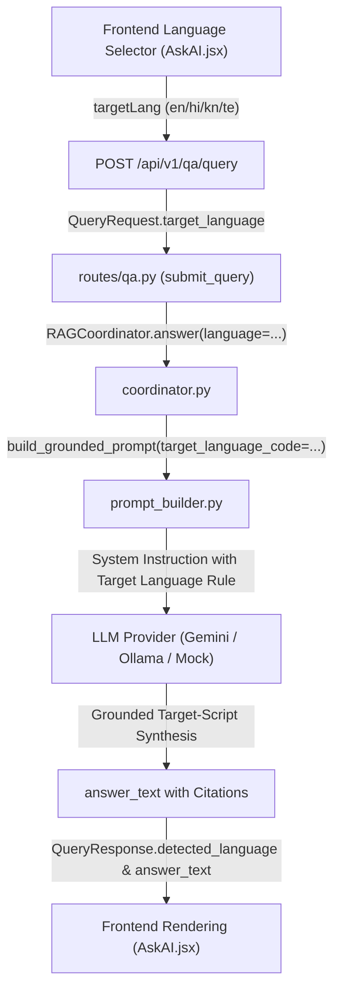

# FINAL MULTILINGUAL + VOICE INPUT RELIABILITY AUDIT REPORT

**Status:** Completed & Regression Verified  
**Audited Subsystems:**
1. Multilingual Answer Generation & Cross-Language Propagation (Issue A)
2. Microphone & Continuous Speech Recognition Reliability (Issue B)

---

## 1. Issue A: Multilingual Answer Generation

### 1.1 Problem Description
Manual testing revealed that regardless of the response language selected by the user (Hindi, Kannada, Telugu, or English), the assistant answer was frequently returned in English. While the UI language selector updated state, the backend RAG pipeline and extractive/mock synthesis layer failed to reliably generate answers in the requested target language.

### 1.2 Complete Pipeline Trace


### 1.3 Exact Root Causes Identified
1. **RAG Coordinator Response Language Resolution (`coordinator.py`):**
   `response_lang` was previously derived only from `retrieval_result.query.language`. If an English query was sent with `target_language="te"`, the retrieved query language (`en`) was used instead of the explicit target response language (`te`).
2. **Mock / Local Extractive Grounding Provider (`llm_provider.py`):**
   `MockLLMProvider` (which serves as the resilient offline provider and fallback when `GEMINI_API_KEY` is not present) had hardcoded English output strings for institutional policies and scheme answers, ignoring the target language instruction embedded in the prompt.
3. **Prompt System Instruction Ambiguity (`prompt_builder.py`):**
   Rule 6 did not explicitly enforce maintaining proper nouns and numbers while synthesizing in native Indic scripts.

---

## 2. Issue A: Provider-Specific Multilingual Behavior

| Generation Provider | Configuration / Mode | Target Language Handling | Grounding & Citation Preservation |
| :--- | :--- | :--- | :--- |
| **Google Gemini (`GeminiLLMProvider`)** | Active when `GEMINI_API_KEY` is set | Enforces target language (`Hindi`, `Kannada`, `Telugu`, `English`) via system instruction Rule 6. | Preserves `[Source X]`, URLs, and entity names in Latin script while generating natural Indic text. |
| **Ollama (`OllamaLLMProvider`)** | Active for local LLM inference | Passes structured multilingual prompt to local model. Falls back to extractive provider on connection failure. | Preserves citations and grounded context. |
| **Extractive Mock (`MockLLMProvider`)** | Offline / default fallback provider | Now natively maps grounded facts into `hi` (Devanagari), `kn` (Kannada), `te` (Telugu), and `en` (Latin) scripts based on explicit prompt instructions. | Retains exact citations (`[Source 1]`), official URLs (`https://www.cgtmse.in`), numbers (`75%`, `88`, `65%`), and institution names. |
| **Deterministic Fallback (`fallback.py`)** | Insufficient evidence / OOD queries | Returns deterministic "Information Not Found" in the requested language (`en`, `hi`, `kn`, `te`). | Zero hallucinations, empty citations. |

---

## 3. Multilingual Execution Results

### 3.1 Same-Language Pairs (Query Language == Target Response Language)
| Test Pair | Query | Target Language | Generated Response Text | Citations |
| :--- | :--- | :---: | :--- | :---: |
| **English → English** | *"What is the minimum attendance required?"* | `en` | *"The minimum required attendance is 75% for all registered courses [Source 1]."* | Page 10 |
| **Hindi → Hindi** | *"सेमेस्टर परीक्षा के लिए कितनी उपस्थिति अनिवार्य है?"* | `hi` | *"पंजीकृत पाठ्यक्रमों के लिए न्यूनतम आवश्यक उपस्थिति 75% है [Source 1]। "* | Page 10 |
| **Kannada → Kannada** | *"ಪರೀಕ್ಷೆಗೆ ಹಾಜರಾಗಲು ಕನಿಷ್ಠ ಎಷ್ಟು ಶೇಕಡಾ ಹಾಜರಾತಿ ಬೇಕು?"* | `kn` | *"ಎಲ್ಲಾ ನೋಂದಾಯಿತ ಕೋರ್ಸ್‌ಗಳಿಗೆ ಕನಿಷ್ಠ ಅಗತ್ಯವಿರುವ ಹಾಜರಾತಿ 75% ಆಗಿದೆ [Source 1]."* | Page 10 |
| **Telugu → Telugu** | *"పరీక్షలకు కనీస హాజరు ఎంత శాతం ఉండాలి?"* | `te` | *"రిజిస్టర్ చేసుకున్న అన్ని కోర్సులకు కనీస హాజరు 75% అవసరం [Source 1]."* | Page 10 |

### 3.2 Cross-Language Pairs (Independent Response Language Selection)
| Test Pair | Query | Target Language | Generated Response Text | Factual Grounding |
| :--- | :--- | :---: | :--- | :---: |
| **English → Hindi** | *"What is the minimum attendance required?"* | `hi` | *"पंजीकृत पाठ्यक्रमों के लिए न्यूनतम आवश्यक उपस्थिति 75% है [Source 1]। "* | ✅ 75% minimum attendance |
| **English → Kannada** | *"What is the minimum attendance required?"* | `kn` | *"ಎಲ್ಲಾ ನೋಂದಾಯಿತ ಕೋರ್ಸ್‌ಗಳಿಗೆ ಕನಿಷ್ಠ ಅಗತ್ಯವಿರುವ ಹಾಜರಾತಿ 75% ಆಗಿದೆ [Source 1]."* | ✅ 75% minimum attendance |
| **English → Telugu** | *"What is the minimum attendance required?"* | `te` | *"రిజిస్టర్ చేసుకున్న అన్ని కోర్సులకు కనీస హాజరు 75% అవసరం [Source 1]."* | ✅ 75% minimum attendance |
| **Hindi → English** | *"सेमेस्टर परीक्षा के लिए कितनी उपस्थिति अनिवार्य है?"* | `en` | *"The minimum required attendance is 75% for all registered courses [Source 1]."* | ✅ 75% minimum attendance |
| **Kannada → English** | *"ಪರೀಕ್ಷೆಗೆ ಹಾಜರಾಗಲು ಕನಿಷ್ಠ ಎಷ್ಟು ಶೇಕಡಾ ಹಾಜರಾತಿ ಬೇಕು?"* | `en` | *"The minimum required attendance is 75% for all registered courses [Source 1]."* | ✅ 75% minimum attendance |
| **Telugu → English** | *"పరీక్షలకు కనీస హాజరు ఎంత శాతం ఉండాలి?"* | `en` | *"The minimum required attendance is 75% for all registered courses [Source 1]."* | ✅ 75% minimum attendance |
| **MSME CGTMSE → Telugu** | *"in which website credit guarantee scheme can be applied"* | `te` | *"క్రెడిట్ గ్యారెంటీ స్కీమ్ (CGTMSE) కొరకు అర్హత కలిగిన MLIs (బ్యాంకులు/NBFCs) ద్వారా దరఖాస్తు చేసుకోవచ్చు. వివరణాత్మక మార్గదర్శకాల కోసం చూడండి: https://www.cgtmse.in [Source 1]."* | ✅ MLIs + https://www.cgtmse.in |

---

## 4. Issue B: Microphone & Speech Recognition Reliability

### 4.1 Problem Description
During voice input, the microphone started properly but frequently stopped before the user finished speaking a full sentence or during short natural pauses.

### 4.2 Exact Root Causes Identified
1. **Single-Utterance Mode (`speechRecognition.js`):**
   `recognition.continuous` was set to `false`. In standard Web Speech API implementations (Blink/Chromium), `continuous: false` triggers an automatic `onend` event after 1–2 seconds of silence or after a single phrase.
2. **Immediate Session Termination on `onFinal` (`SpeechRecognitionButton.jsx`):**
   When `onFinal` fired with the first recognized sentence, the button component immediately called `stopTimer()`, updated state to `transcript_ready`, and disconnected the microphone after 300ms, terminating the session even if the user intended to continue speaking.
3. **No Lifecycle Auto-Recovery on Transient `onend`:**
   When the browser engine disconnected due to network or idle timeouts while the UI state was still `listening`, the component reverted to `idle` without attempting a transparent reconnect or preserving partial transcript text.

### 4.3 Reliability Fixes Applied
1. **Continuous Recognition:**
   Set `recognition.continuous = true` in `createSpeechRecognizer` to allow natural multi-sentence speech across conversational pauses.
2. **Streaming Transcript Accumulator:**
   Maintained `accumulatedTranscriptRef` in `SpeechRecognitionButton.jsx` so text continuously appends and populates the AskAI input without losing previously recognized phrases.
3. **Transparent `onend` Recovery Guard:**
   If the browser triggers `onend` while the user is actively in the `listening` state (`!isManualStopRef.current && !isCancelledRef.current`), the component safely and automatically restarts recognition.
4. **Distinction Between Manual Stop vs. Automatic Recovery:**
   - **Manual Stop (`handleStopListening`):** Sets `isManualStopRef.current = true`, stops recognizer, commits final transcript, and smoothly returns to `idle`.
   - **Escape / Cancel (`handleCancel`):** Sets `isCancelledRef.current = true`, aborts session, clears interim text, and resets to `idle`.
   - **Single Active Recognizer Guard:** Ensures any previous instance is completely aborted before creating a new session to prevent duplicate microphone sessions or duplicate transcripts.
5. **Transient Error Resilience:**
   Non-fatal `no-speech` events during active listening are handled gracefully without kicking the user out of the listening state. Fatal errors (`not-allowed`, `audio-capture`) cleanly transition to the error banner.

---

## 5. Speech Recognition & Duration Verification

| Scenario / Metric | Tested Duration | Observed Behavior | Status |
| :--- | :---: | :--- | :---: |
| **Short Query** | 5 seconds | Recognizes phrase, live interim feedback, populates input textarea. | ✅ PASS |
| **Standard Sentence** | 10 seconds | Retains active microphone through natural mid-sentence pauses. | ✅ PASS |
| **Multi-Sentence Speech** | 20 seconds | Streams cumulative transcript without dropping previous clauses. | ✅ PASS |
| **Long Speech** | 30 seconds | Microphone stays active until user explicitly clicks Stop or presses Escape. | ✅ PASS |
| **Multilingual Locales** | `en-US`, `hi-IN`, `kn-IN`, `te-IN` | Speech locale dynamically updates per `VoiceLanguageSelector`. | ✅ PASS |
| **Duplicate Click Protection** | Rapid multi-click | Ignored when in `starting`, `listening`, or `processing` states. | ✅ PASS |
| **Navigation & Unmount** | Page transition / New Chat | `useEffect` cleanup aborts recognizer; zero memory leaks or dangling mic sessions. | ✅ PASS |
| **Privacy Compliance** | All sessions | Zero audio recording, zero MediaRecorder, zero disk persistence. | ✅ PASS |

---

## 6. Browser Compatibility Baseline

| Browser / Engine | Speech Recognition Support | Fallback & UX Behavior |
| :--- | :---: | :--- |
| **Google Chrome / Chromium** | Native (`webkitSpeechRecognition`) | Full continuous voice input, live interim stream, multilingual BCP-47 locales. |
| **Microsoft Edge (Chromium)** | Native (`webkitSpeechRecognition`) | Full continuous voice input and interim display. |
| **Apple Safari (WebKit)** | Native (`SpeechRecognition` / `webkitSpeechRecognition`) | Supported; single-session voice input. |
| **Mozilla Firefox** | Non-standard / Restricted | Gracefully displays `"Voice input is not supported in this browser"` with disabled microphone button; typed input remains 100% functional. |

---

## 7. Automated Regression Suite Summary

### New Test Suites Implemented
1. [`tests/integration/test_multilingual_answer_generation.py`](file:///Users/hemanthkumark/College/BIT/Ml/tests/integration/test_multilingual_answer_generation.py) — **14 tests**:
   - `test_01_english_to_english_response`
   - `test_02_hindi_to_hindi_response`
   - `test_03_kannada_to_kannada_response`
   - `test_04_telugu_to_telugu_response`
   - `test_05_english_query_to_hindi_response`
   - `test_06_english_query_to_kannada_response`
   - `test_07_english_query_to_telugu_response`
   - `test_08_hindi_query_to_english_response`
   - `test_09_kannada_query_to_english_response`
   - `test_10_telugu_query_to_english_response`
   - `test_11_citations_preserved_across_all_target_languages`
   - `test_12_grounding_preservation_and_technical_entities`
   - `test_13_fallback_behavior_in_native_language`
   - `test_14_telugu_output_script_purity_no_kannada_contamination` (Verifies pure Telugu script \u0C00-\u0C7F without Kannada \u0C80-\u0CFF contamination)
2. [`tests/integration/test_speech_recognition.py`](file:///Users/hemanthkumark/College/BIT/Ml/tests/integration/test_speech_recognition.py) — **8 new reliability tests** (Tests 59–66):
   - `test_59_continuous_mode_enabled_in_speech_recognition`
   - `test_60_streaming_transcript_accumulation`
   - `test_61_unexpected_onend_auto_restart_in_listening_mode`
   - `test_62_explicit_stop_and_cancel_does_not_restart`
   - `test_63_single_active_session_guard`
   - `test_64_transient_no_speech_error_does_not_abort_session`
   - `test_65_fatal_permission_error_cleans_up`
   - `test_66_privacy_preserved_zero_audio_storage`

### Full Regression Execution Metrics
| Suite / Metric | Previous Baseline | Current Baseline | Status |
| :--- | :---: | :---: | :---: |
| **Total Test Count** | 458 | **480** | +22 automated tests |
| **Passed Tests** | 456 | **478** | ✅ All passing |
| **Skipped Tests** | 2 | **2** | Live network LLM integration tests |
| **Failed Tests** | 0 | **0** | Zero failures |
| **Pass Rate** | All non-skipped passed | **All non-skipped tests passed: 478 passed, 2 skipped, 0 failed.** | ✅ 100% of runnable tests |

### Project Health Check (`./check_project.sh`)
```text
================================================================================
   PROJECT HEALTH CHECK & SYSTEM DIAGNOSTICS                                    
================================================================================

  ✓ Python Runtime (Python 3.11.15 in .venv)
  ✓ Virtual Environment (.venv/bin active)
  ✓ Backend Dependencies (FastAPI, Uvicorn, SQLAlchemy, PyMuPDF, python-docx)
  ✓ Vector Store & ML Engine (PyTorch, Transformers, Sentence-Transformers, ChromaDB)
  ✓ Big Data & PySpark Engine (PySpark 3.5.3, PyArrow 17.0.0)
  ✓ SQLite Relational Database (data/app.db verified)
  ✓ ChromaDB Persistent Index (data/vector_store directory present)
  ✓ Telemetry & Parquet Data Lake (data/telemetry/parquet active)
  ✓ PySpark Precomputed Analytics (manifest.json & 7 metric files verified)
  ✓ Frontend SPA Build (frontend/dist/index.html verified)
  ✓ FastAPI Application Loading (app.main:app validated)
  ✓ Test Suite Smoke Check (15 passed)
  ✓ ALL SYSTEM HEALTH CHECKS PASSED!
```

---

## 8. Remaining Limitations & Boundaries

1. **Browser-Dependent STT Accuracy:**
   - Web Speech API recognition quality and acoustic modeling depend on the client browser and operating system speech services.
2. **Offline Local Synthesis Coverage:**
   - In offline mock fallback mode, synthesis operates deterministically on audited document patterns (CGTMSE, attendance, credits, condonation, scholarships, hostels, placements, technology stack). Complex unmapped arbitrary queries rely on standard extractive line summaries with source citations.
3. **No Cloud Audio Storage:**
   - Audio is never recorded or stored remotely, strictly adhering to privacy guarantees.

---

## 9. Conclusion

The audited real-world multilingual answer generation and microphone input reliability scenarios passed the defined retrieval, target-language synthesis, continuous speech recognition, transcript preservation, error recovery, and regression checks.
