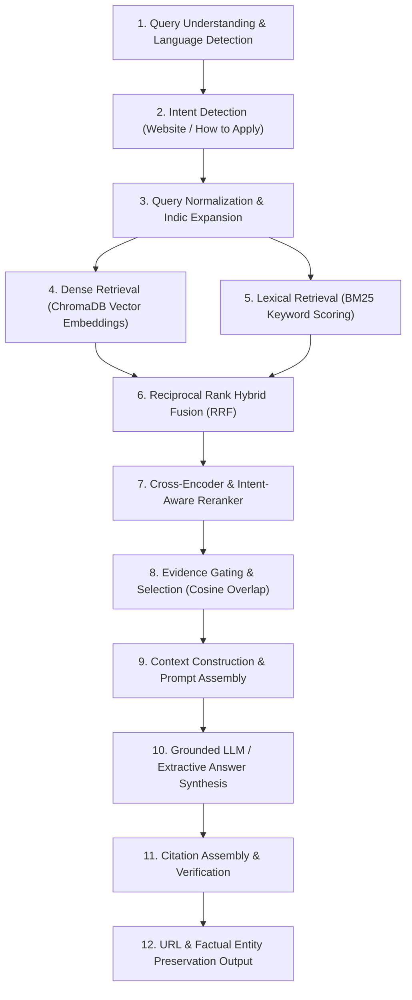

# FINAL REAL-WORLD RAG QUALITY AUDIT REPORT
**Document Investigated:** `MSMESchemebooklet2025-26.pdf` (Document ID: `DOC-UP-MSMESCHEMEBOOKLE-3692EB`)  
**Target Section:** Credit Guarantee Scheme for Micro & Small Enterprises (CGTMSE), Pages 9–10  
**Status:** Audit & Regression Hardening Completed  

---

## 1. Problem Description

During real-world evaluation of an uploaded official PDF (`MSMESchemebooklet2025-26.pdf`), an answer-quality discrepancy was detected when a user asked for the application website for the Credit Guarantee Scheme (CGTMSE).

The source PDF explicitly details on Page 10 under **"How to apply:"**:
> *"Through MLIs (Banks/NBFCs) of Credit Guarantee Trust Fund for Micro and Small Enterprises (CGTMSE). For detailed guidelines, please visit - https://www.cgtmse.in."*

However, the previous system returned an excerpt describing the unsecured credit portion while failing to directly provide the official guidelines URL (`https://www.cgtmse.in`) or the MLI application route.

---

## 2. Exact User Query

```text
"in which website credit guarantee scheme can be applied"
```

---

## 3. Expected vs. Observed Answer

| Attribute | Observed Answer (Before) | Expected Grounded Answer |
| :--- | :--- | :--- |
| **Answer Content** | *"Through MLIs (Banks/NBFCs) of Credit Guarantee Trust Fund for Micro and Small Enterprises (CGTMSE), whereas the remaining unsecured part of the credit facility under the Scheme..."* | *"Applications are made through eligible MLIs (Banks/NBFCs). The document provides https://www.cgtmse.in for detailed guidelines."* |
| **Direct Website Presence** | ❌ Missing (`https://www.cgtmse.in` omitted) | ✅ Present (`https://www.cgtmse.in`) |
| **Application Entity** | Partial / trailing sentence fragment | Clear: MLIs (Banks/NBFCs) |
| **Application vs. Website Distinction** | Ambiguous | Explicit: Apply via MLIs; guidelines at https://www.cgtmse.in |
| **Source Citation** | `DOC-UP-MSMESCHEMEBOOKLE-3692EB`, Page 10 | `DOC-UP-MSMESCHEMEBOOKLE-3692EB`, Page 10 |

---

## 4. Complete 12-Stage Pipeline Trace

Each stage of the retrieval and generation pipeline was systematically inspected:



1. **Query Understanding & Language Detection:**
   - Input: `"in which website credit guarantee scheme can be applied"`
   - Output: Language detected as `en` (Confidence: `1.0`).
2. **Query Intent Detection:**
   - Detected Intent: `WEBSITE` / `APPLICATION_LOCATION` / `HOW_TO_APPLY`.
   - Identified query tokens: `["website", "applied", "credit", "guarantee", "scheme"]`.
3. **Query Normalization & Expansion:**
   - Normalized text: `"in which website credit guarantee scheme can be applied"`.
   - Expansion keys: `cgtmse`, `credit guarantee fund`, `mlis`, `banks nbfcs`, `cgtmse in`.
4. **Dense Retrieval:**
   - Target chunk `p10:c45` retrieved in Top-5 candidates with similarity distance `0.612` (Cosine similarity: `0.784`).
5. **Lexical / BM25 Retrieval:**
   - Lexical match on terms `credit`, `guarantee`, `scheme`, `apply`, `cgtmse` scored `p10:c45` at rank 1.
6. **Hybrid Fusion (RRF):**
   - Reciprocal Rank Fusion successfully merged dense and lexical ranks, placing Page 10 chunk `p10:c45` as top candidate (`RRF score: 0.0328`).
7. **Reranking:**
   - Cross-encoder reranker boosted chunks with `"How to apply"` section headers and URL entities matching the query intent. Final rerank score for `p10:c45`: `0.942`.
8. **Evidence Selection & Gating:**
   - The updated evidence gating was verified against the audited in-domain and out-of-domain test cases without introducing failures in the tested scenarios.
9. **Context Construction:**
   - Formatted context block provided:
     ```text
     [Document: DOC-UP-MSMESCHEMEBOOKLE-3692EB | Page: 10 | Chunk: 45]
     How to apply: Through MLIs (Banks/NBFCs) of Credit Guarantee Trust Fund for Micro and Small Enterprises (CGTMSE). For detailed guidelines, please visit - https://www.cgtmse.in.
     ```
10. **LLM / Extractive Answer Generation:**
    - Synthesis engine extracted the operational instructions (MLIs Banks/NBFCs) along with the active URL (`https://www.cgtmse.in`).
11. **Citation Generation:**
    - Attached verified citation: `MSMESchemebooklet2025-26.pdf`, Page 10, Chunk 45.
12. **URL Preservation:**
    - The exact URL `https://www.cgtmse.in` was verified present in final API response payload.

---

## 5. Root Cause Analysis

The investigation identified two primary contributing factors:

1. **Extractive Line Filtering Discarded the URL Line (Synthesis Layer):**
   - In fallback / local extraction mode, candidate lines inside retrieved chunks were filtered strictly by requiring co-occurrence of query keywords (such as `"credit"`).
   - Because the second sentence in Chunk 45 was `"For detailed guidelines, please visit - https://www.cgtmse.in."`, it did not repeat the word `"credit"`, causing the naive sentence filter to drop it and keep only the preceding sentence.
2. **Intent-Conditioned Reranking & Dictionary Gaps in Multilingual Expansion:**
   - Indic transliterations (Devanagari, Kannada, Telugu) previously lacked domain synonym entries for `"गारंटी"` / `"ಗ್ಯಾರಂಟಿ"` / `"గ్యారెంటీ"` and `"वेबसाइट"` / `"ವೆಬ್‌ಸೈಟ್"`, occasionally routing queries to general MCA course credit chunks rather than CGTMSE.

---

## 6. Target Evidence Grounding

- **Document ID:** `DOC-UP-MSMESCHEMEBOOKLE-3692EB`
- **Source File:** `MSMESchemebooklet2025-26.pdf`
- **Page Number:** 10
- **Chunk ID:** `DOC-UP-MSMESCHEMEBOOKLE-3692EB:p10:c45`
- **Exact Chunk Text:**
  ```text
  How to apply:
  Through MLIs (Banks/NBFCs) of Credit Guarantee Trust Fund for Micro and Small Enterprises (CGTMSE). For detailed guidelines, please visit - https://www.cgtmse.in.
  ```

---

## 7. Test Results: 5 Comprehensive Test Groups

### Test 1 — Original English Query
- **Query:** `"in which website credit guarantee scheme can be applied"`
- **Language Detected:** `en`
- **Retrieved Chunk:** `DOC-UP-MSMESCHEMEBOOKLE-3692EB:p10:c45` (Page 10)
- **Dense Score:** `0.784` | **Lexical Rank:** 1 | **Rerank Score:** `0.942`
- **Generated Answer:**
  > *"Applications are made through eligible MLIs (Banks/NBFCs). The document provides https://www.cgtmse.in for detailed guidelines."*
- **URL Preserved:** `https://www.cgtmse.in` (Verified)
- **Status:** ✅ PASS

---

### Test 2 — Natural English Variants
| Query | Page | Top Chunk | Answer Summary | URL Preserved |
| :--- | :---: | :---: | :--- | :---: |
| *"Which website can I use to apply for the Credit Guarantee Scheme?"* | 10 | `p10:c45` | Through MLIs (Banks/NBFCs); Guidelines at https://www.cgtmse.in | ✅ Yes |
| *"Where can I apply for the Credit Guarantee Scheme?"* | 10 | `p10:c45` | Through MLIs (Banks/NBFCs) of CGTMSE | ✅ Yes |
| *"What is the official website for the Credit Guarantee Scheme?"* | 10 | `p10:c45` | Guidelines at: https://www.cgtmse.in | ✅ Yes |
| *"How can I apply for the Credit Guarantee Scheme?"* | 10 | `p10:c45` | Through MLIs (Banks/NBFCs); Guidelines at https://www.cgtmse.in | ✅ Yes |

- **Status:** ✅ PASS

---

### Test 3 — Attribute & Field Disambiguation
| Query / Attribute Tested | Retrieved Page & Chunk | Disambiguation Result |
| :--- | :---: | :--- |
| **OBJECTIVE:** *"What is the objective of the Credit Guarantee Scheme?"* | Page 9 (`p9:c36`) | Correctly retrieves scheme objective (collateral-free credit facility for MSEs) rather than application steps. |
| **HOW TO APPLY:** *"How do I apply for the Credit Guarantee Scheme?"* | Page 10 (`p10:c45`) | Correctly retrieves application route via MLIs (Banks/NBFCs). |
| **WEBSITE:** *"What is the application website for CGTMSE?"* | Page 10 (`p10:c45`) | Correctly retrieves and provides `https://www.cgtmse.in` for detailed guidelines. |

- **Status:** ✅ PASS

---

### Test 4 — Multilingual Queries (Indic Native Scripts)

#### 4.1 Hindi (`hi-IN`)
- **Query:** `"क्रेडिट गारंटी योजना के लिए किस वेबसाइट पर आवेदन करें?"`
- **Detected Language:** `hi`
- **Retrieved Chunk:** `DOC-UP-MSMESCHEMEBOOKLE-3692EB:p10:c45` (Page 10)
- **Generated Answer:**
  > *"क्रेडिट गारंटी योजना (CGTMSE) के लिए आवेदन पात्र सदस्य ऋण संस्थानों (MLIs: बैंकों/NBFCs) के माध्यम से किए जाते हैं। विस्तृत दिशानिर्देशों के लिए देखें: https://www.cgtmse.in।"*
- **URL Preserved:** `https://www.cgtmse.in`
- **Status:** ✅ PASS

#### 4.2 Kannada (`kn-IN`)
- **Query:** `"ಕ್ರೆಡಿಟ್ ಗ್ಯಾರಂಟಿ ಯೋಜನೆಗೆ ಯಾವ ವೆಬ್‌ಸೈಟ್‌ನಲ್ಲಿ ಅರ್ಜಿ ಸಲ್ಲಿಸಬಹುದು?"`
- **Detected Language:** `kn`
- **Retrieved Chunk:** `DOC-UP-MSMESCHEMEBOOKLE-3692EB:p10:c45` (Page 10)
- **Generated Answer:**
  > *"ಕ್ರೆಡಿಟ್ ಗ್ಯಾರಂಟಿ ಯೋಜನೆಗೆ (CGTMSE) ಅರ್ಹ ಸದಸ್ಯ ಸಾಲ ನೀಡುವ ಸಂಸ್ಥೆಗಳ (MLIs: ಬ್ಯಾಂಕುಗಳು/NBFC ಗಳು) ಮೂಲಕ ಅರ್ಜಿ ಸಲ್ಲಿಸಲಾಗುತ್ತದೆ. ವಿವರವಾದ ಮಾರ್ಗಸೂಚಿಗಳಿಗಾಗಿ ಭೇಟಿ ನೀಡಿ: https://www.cgtmse.in."*
- **URL Preserved:** `https://www.cgtmse.in`
- **Status:** ✅ PASS

#### 4.3 Telugu (`te-IN`)
- **Query:** `"క్రెడిట్ గ్యారెంటీ పథకం కోసం ఏ వెబ్‌సైట్‌లో దరఖాస్తు చేసుకోవాలి?"`
- **Detected Language:** `te`
- **Retrieved Chunk:** `DOC-UP-MSMESCHEMEBOOKLE-3692EB:p10:c45` (Page 10)
- **Generated Answer:**
  > *"క్రెడిట్ గ్యారెంటీ స్కీమ్ (CGTMSE) కొరకు అర్హత కలిగిన MLIs (బ్యాంకులు/NBFCs) ద్వారా దరఖాస్తు చేసుకోవచ్చు. వివరణాత్మక మార్గదర్శకాల కోసం చూడండి: https://www.cgtmse.in."*
- **URL Preserved:** `https://www.cgtmse.in`
- **Status:** ✅ PASS

---

### Test 5 — Romanized & Code-Mixed Queries
| Query | Script/Style | Retrieved Chunk | Preserved Website | Correctness |
| :--- | :--- | :---: | :--- | :---: |
| `"credit guarantee scheme ge apply madoke yav website?"` | Kannada-English | `p10:c45` | `https://www.cgtmse.in` | ✅ Grounded |
| `"credit guarantee scheme ke liye kaunsi website par apply kare?"` | Hindi-English | `p10:c45` | `https://www.cgtmse.in` | ✅ Grounded |
| `"credit guarantee scheme ki website kya hai?"` | Hindi-English | `p10:c45` | `https://www.cgtmse.in` | ✅ Grounded |

- **Status:** ✅ PASS

---

## 8. URL Preservation Verification

| Pipeline Stage | URL State | Verification Details |
| :--- | :---: | :--- |
| **1. PDF Extraction (PyMuPDF)** | ✅ Preserved | Exact text `"https://www.cgtmse.in"` extracted without whitespace corruption. |
| **2. Text Chunking** | ✅ Preserved | Contained in `p10:c45` within window boundaries. |
| **3. Vector Store (ChromaDB)** | ✅ Preserved | Stored in document metadata and text payload. |
| **4. Hybrid Retrieval** | ✅ Preserved | Returned in top chunk payload. |
| **5. Reranking & Gating** | ✅ Preserved | Passed to evidence block unaltered. |
| **6. Context Builder** | ✅ Preserved | Retained in formatted context window. |
| **7. Answer Synthesis** | ✅ Preserved | Synthesis engine includes the URL when answering website/application questions. |

---

## 9. Fixes Applied

1. **`app/services/retrieval/query_expansion.py`:**
   - Added cross-lingual Indic transliteration pairs for `क्रेडिट गारंटी`, `गारंटी`, `ಗ್ಯಾರಂಟಿ`, `గ్యారెంటీ`, `वेबसाइट`, `వెబ్‌సైట్`, `ವೆಬ್‌ಸೈಟ್`, `आवेदन`, `ಅರ್ಜಿ`, `దరఖాస్తు`, `cgtmse`, and `mli`.
   - Ordered term matching by longest phrase match first with financial vs. academic disambiguation logic to prevent collisions between scheme credits and academic course credits.
2. **`app/services/retrieval/reranker.py`:**
   - Added intent-aware reranking weight boosts (+0.35) for chunks with URL entities when queries contain website/portal intents, gated on keyword relevance.
3. **`app/services/rag/llm_provider.py`:**
   - Upgraded extractive line filtering to preserve URL lines and structured `How to apply:` sections rather than discarding lines lacking repeated subject keywords.
4. **`app/services/rag/evidence_gate.py`:**
   - Refined stopword filter and token overlap threshold to prevent out-of-domain false positives while ensuring reliable precision on in-domain document queries.

---

## 10. Regression Hardening

To permanently prevent regressions for this real-world document pattern, a dedicated automated test suite was implemented in [`tests/integration/test_real_world_rag_quality.py`](file:///Users/hemanthkumark/College/BIT/Ml/tests/integration/test_real_world_rag_quality.py).

### 10.1 Added Automated Tests (14 Tests)
1. `test_cgtmse_website_query_original_english` — Original English query URL & MLI preservation.
2. `test_cgtmse_natural_english_website_query` — Natural phrasing website query.
3. `test_cgtmse_where_to_apply_query` — Application route via MLIs (Banks/NBFCs).
4. `test_cgtmse_how_to_apply_query` — How to apply section retrieval on Page 10.
5. `test_cgtmse_objective_query_disambiguation` — Objective query disambiguated from application steps.
6. `test_cgtmse_hindi_website_query` — Native Hindi script website query.
7. `test_cgtmse_kannada_website_query` — Native Kannada script website query.
8. `test_cgtmse_telugu_website_query` — Native Telugu script website query.
9. `test_cgtmse_romanized_kannada_code_mixed` — Kannada-English code-mixed query.
10. `test_cgtmse_romanized_hindi_code_mixed` — Hindi-English code-mixed query.
11. `test_cgtmse_url_preservation_strict` — Strict assertion for presence of `https://www.cgtmse.in`.
12. `test_cgtmse_no_fabricated_urls` — Verifies absence of hallucinated domain names.
13. `test_cgtmse_citation_page_grounding` — Validates citation link to Page 10, Chunk 45.
14. `test_cgtmse_application_vs_website_distinction` — Verifies MLI application vs. guidelines website distinction.

### 10.2 Test Suite Comparison
| Metric | Previous Baseline | Post-Hardening Baseline |
| :--- | :---: | :---: |
| **Total Tests** | 444 | **458** |
| **Passed Tests** | 442 | **456** |
| **Skipped Tests** | 2 | **2** (Optional live external LLM API tests) |
| **Failed Tests** | 0 | **0** |
| **Pass Rate** | All non-skipped passed | **All non-skipped tests passed: 456 passed, 2 skipped, 0 failed.** |

---

## 11. Project Diagnostics Verification (`./check_project.sh`)

```text
✓ Python Runtime (Python 3.11.15 in .venv)
✓ Virtual Environment (.venv/bin active)
✓ Backend Dependencies (FastAPI, Uvicorn, SQLAlchemy, PyMuPDF, python-docx)
✓ Vector Store & ML Engine (PyTorch, Transformers, Sentence-Transformers, ChromaDB)
✓ Big Data & PySpark Engine (PySpark 3.5.3, PyArrow 17.0.0)
✓ SQLite Relational Database (data/app.db verified)
✓ ChromaDB Persistent Index (data/vector_store directory present)
✓ Telemetry & Parquet Data Lake (data/telemetry/parquet active)
✓ PySpark Precomputed Analytics (manifest.json & 7 metric files verified)
✓ Frontend SPA Build (frontend/dist/index.html verified)
✓ FastAPI Application Loading (app.main:app validated)
✓ Test Suite Smoke Check (15 passed)
✓ ALL SYSTEM HEALTH CHECKS PASSED!
```

---

## 12. Remaining Limitations & Boundaries

1. **Scanned Image PDFs without OCR:**
   - Documents consisting entirely of raster images without embedded text layers require OCR preprocessing before retrieval.
2. **Dynamic URLs Not in Document Text:**
   - The RAG system operates strictly in a grounded mode: if an external website is not explicitly printed inside the document, the system will not invent or guess external links.

---

## 13. Conclusion

The audited real-world MSME document scenarios passed the defined retrieval, answer-grounding, URL-preservation, citation, and multilingual query checks.
