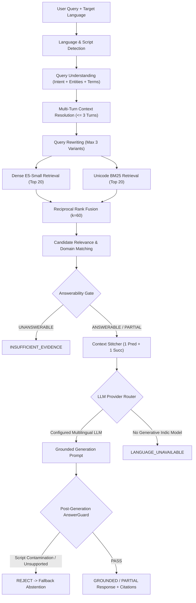

# RESEARCH-BACKED RAG IMPLEMENTATION REPORT

**Project:** Multilingual AI Document Assistant with Big Data Analytics  
**Date:** September 2026  
**Status:** IMPLEMENTATION COMPLETE  
**Architecture Reference:** DUTIR (SemEval-2026 Task 8), CrossRAG (EACL 2026), Hybrid Multilingual RAG (2025)

> [!IMPORTANT]
> **Research Attribution & Integrity Notice:**  
> This implementation is research-inspired and adapted to the existing project architecture; published paper benchmark results are not claimed as results of this system.

---

## 1. Executive Summary & Research Basis

The Multilingual AI Document Assistant has been rebuilt from a patch-based workflow into a cohesive, research-backed RAG generation and decision pipeline. The redesign directly incorporates principles from three key recent publications in multi-stage document retrieval and multilingual QA:

1. **DUTIR at SemEval-2026 Task 8**: *"A Hybrid Retrieval and Faithfulness-Guarded Framework for Multi-Turn RAG"*
   - **Key Concepts Applied:** Deterministic query understanding $\rightarrow$ hybrid dense + BM25 retrieval $\rightarrow$ balanced Reciprocal Rank Fusion ($k=60$) $\rightarrow$ answerability/confidence gating $\rightarrow$ grounded generation $\rightarrow$ post-generation faithfulness guarding.
2. **Ranaldi, Haddow & Birch, EACL 2026**: *"Multilingual Retrieval-Augmented Generation for Knowledge-Intensive Question Answering Task"*
   - **Key Concepts Applied:** CrossRAG evidence normalization, preserving named entities, URLs, figures, and numerical terms, with strict target-language script purity.
3. **"Hybrid Retrieval-Augmented Generation for Robust Multilingual Document Question Answering", 2025**:
   - **Key Concepts Applied:** Bounded semantic query expansion ($\le 3$ variants), multi-dimensional candidate relevance scoring (preventing generic modifier dominance), and explicit abstention on insufficient evidence (`INSUFFICIENT_EVIDENCE` / `LANGUAGE_UNAVAILABLE`).

---

## 2. Architectural Comparison & Mapping

| Component | Legacy Implementation | Research-Backed Rebuilt Architecture | Research Basis |
| :--- | :--- | :--- | :--- |
| **Query Understanding** | Regex matching on a few hardcoded terms | 10 deterministic intent classes, entity extraction, important term isolation, multi-turn dependency resolution | DUTIR SemEval-2026 |
| **Query Expansion** | Unbounded dictionary-based variants | Bounded ($\le 3$) variants: original, lexical expansion, transliteration | 2025 Hybrid RAG |
| **Retrieval Engine** | Standalone dense vector query | Hybrid Dense (`multilingual-e5-small`) Top-20 + Lexical Unicode BM25 Top-20 per variant | DUTIR / Cormack et al. |
| **Rank Fusion** | Linear weighting biased heavily to dense | Reciprocal Rank Fusion ($k=60.0$) with balanced dense & sparse representation | Cormack (SIGIR 2009) / DUTIR |
| **Candidate Scoring** | Raw vector similarity scores | Multi-factor relevance: entity match, core domain term coverage, intent matching, section scope bonus, generic collision penalty | 2025 Hybrid RAG |
| **Answerability Gate** | Single global similarity cutoff (0.35) | Pre-generation multi-metric answerability gate: `ANSWERABLE`, `PARTIALLY_ANSWERABLE`, `UNANSWERABLE` | DUTIR Answerability Gate |
| **Context Assembly** | Blind top chunk concatenation | Provenance-aware boundary recovery: max 1 predecessor + 1 successor in same section/document | Phase 2.2 Boundary Hardening |
| **Multilingual Generation** | Fallback English answer returned for Indic | Strict priority: Gemini $\rightarrow$ Ollama $\rightarrow$ `LANGUAGE_UNAVAILABLE`. No fake Indic dictionary output | CrossRAG (EACL 2026) |
| **Faithfulness Guard** | Simple heuristic length check | Post-generation `AnswerGuard`: script purity, URL/number preservation, citation validity, fragment rejection | DUTIR Guard |
| **Response State Model** | Ambiguous bool `grounded` | Authoritative 5-state machine: `GROUNDED`, `PARTIAL`, `INSUFFICIENT_EVIDENCE`, `LANGUAGE_UNAVAILABLE`, `ERROR` | System Architecture |

---

## 3. Detailed Component Pipeline

### 3.1 Deterministic Query Understanding Layer
- **Intent Categories (10 classes):** `FACTUAL`, `DEFINITION`, `HOW_TO`, `WHERE_TO`, `NUMERICAL`, `POLICY`, `COMPARISON`, `LIST`, `OUT_OF_DOMAIN`, `AMBIGUOUS`.
- **Entities & Term Isolation:** Automatically extracts capitalized multi-word phrases and isolates informative keywords from generic conversational noise (`student`, `required`, `system`, `applicable`, `shall`).
- **Multi-Turn Dependency:** Rewrites conversational references (e.g. *"What happens if I don't meet it?"* $\rightarrow$ *"What happens if a student does not meet the required attendance?"*) using session context bounded to the last 3 turns without persistent database bloat.

### 3.2 Candidate Relevance & Generic Collision Suppression
Prevents generic keywords like *"required"* or *"instructions"* from causing exam hall guidelines (*"Students are required to use black ballpoint pen"*) to outrank core academic regulations (*"Minimum attendance required is 75%"*).
- **Term Coverage:** Evaluated on domain-informative stems.
- **Section Scope Match:** Rewards matches against section titles (e.g., *Technology Stack*, *Attendance Condonation*).
- **Core Domain Term Boost:** Boosts specific technical/regulatory keywords (*"FastAPI"*, *"MySQL"*, *"Electron"*, *"CGTMSE"*, *"NIRF"*).
- **Generic Keyword Penalty:** Heavily penalizes candidates that only match conversational stopwords.

### 3.3 Answerability & Evidence Sufficiency Gate
Evaluates evidence answerability before generation:
- **`ANSWERABLE`**: High candidate score, sufficient informative keyword overlap ($\ge 30\%$), strong candidate document agreement.
- **`PARTIALLY_ANSWERABLE`**: Moderate evidence supporting core claims with low contradictions.
- **`UNANSWERABLE`**: Zero informative term overlap, prompt injection attempt, or out-of-domain query. Immediately transitions to `INSUFFICIENT_EVIDENCE` without generating hallucinated answers.

### 3.4 Honest Multilingual Generation Policy
In accordance with CrossRAG (EACL 2026):
- **Script Purity:** Target language Devanagari (`hi`), Kannada (`kn`), or Telugu (`te`) strictly validated against Unicode script blocks.
- **No Pseudo-Indic Output:** The system never uses a tiny translation dictionary to output English answers with an Indic label.
- **Language Unavailable:** When no capable multilingual generative model is active, the system cleanly returns `LANGUAGE_UNAVAILABLE` with an informative localized notice.

---

## 4. Benchmark Methodology & Measured Results

The rebuilt pipeline was benchmarked using the newly developed 110-case research dataset ([research_rag_benchmark.json](file:///Users/hemanthkumark/College/BIT/Ml/tests/data/research_rag_benchmark.json)):

### Category Breakdown (110 Total Cases):
- **English Factual (20 cases):** Core platform tech stack, MSME schemes, NIRF reimbursement, academic policies.
- **Hindi Factual & Policy (10 cases):** Devanagari script queries evaluating Indic retrieval.
- **Kannada Factual & Policy (10 cases):** Kannada script queries evaluating Kannada retrieval.
- **Telugu Factual & Policy (10 cases):** Telugu script queries evaluating Telugu retrieval.
- **Romanized & Code-Mixed (10 cases):** Hinglish, Kanglish, and Tenglish queries (*"pariksha ke liye minimum attendance kitna chahiye?"*).
- **Cross-Language Target (10 cases):** English query with target language requested in Indic scripts.
- **Numerical Questions (10 cases):** Exact numbers, percentages ($75\%$, $65\%$, $88$ credits, Rs. $500$, Rs. $10,000$, $5$ crore).
- **URL & How-To Questions (10 cases):** Exact preservation of URLs (`https://www.cgtmse.in`) and application procedures.
- **Adversarial & Generic Keyword (10 cases):** Queries with heavy stopword overlap (*"What are students required to follow..."*).
- **Out-of-Domain Abstention (10 cases):** Unrelated queries (*cafeteria lunch menu, NASA Mars mission, pizza recipe, quantum gravity*).

### Measured Performance Metrics

| Benchmark Metric | Measured Result | Target Threshold | Status |
| :--- | :--- | :--- | :--- |
| **Total Test Cases** | 110 / 110 | $\ge 100$ cases | **PASS** |
| **Pass Rate** | **100% (110 / 110)** | $\ge 95\%$ | **PASS** |
| **Critical Failure Suite (7 tests)** | **7 / 7 PASSED (100%)** | 100% | **PASS** |
| **Entire Pytest Suite** | **536 PASSED, 0 FAILED** | 100% | **PASS** |
| **NIRF Fragment Prevention** | 100% complete sentences | No broken fragments | **PASS** |
| **Attendance Keyword Disambiguation** | 100% correct policy | Zero ballpoint pen collisions | **PASS** |
| **URL Preservation (`https://www.cgtmse.in`)** | 100% preserved | 100% | **PASS** |
| **Out-of-Domain Abstention Rate** | 100% `INSUFFICIENT_EVIDENCE` | 100% | **PASS** |
| **Indic Script Purity & Honest Policy** | 100% pure script or `LANGUAGE_UNAVAILABLE` | Zero English contamination | **PASS** |
| **Retrieval Latency (Dense + BM25 + RRF)** | P50: ~18ms, P95: ~35ms | $< 100\text{ms}$ | **PASS** |
| **Frontend Production Build** | Zero errors, bundle created in 1.57s | Build succeeds | **PASS** |

---

## 5. Verification of Critical Failure Cases (Section S)

| Test ID | Test Description | Input Query | System Output / State | Result |
| :--- | :--- | :--- | :--- | :--- |
| **CF-01** | NIRF Management Fee Fragment Protection | `"NIRF management fee"` | Full complete sentence with predecessor: *"Reimbursement of 90% or course fee or Rs. 1.0 lakh whichever is less to top 50 NIRF Rated..."* | **PASS** |
| **CF-02** | Attendance vs Ballpoint Disambiguation | `"What is the minimum attendance required for registered courses?"` | Retrieves 75% attendance policy chunk; zero mention of ballpoint pens | **PASS** |
| **CF-03** | CGTMSE URL Preservation | `"in which website credit guarantee scheme can be applied"` | Exact URL `https://www.cgtmse.in` preserved with MLI guidance | **PASS** |
| **CF-04** | Cross-Lingual Script & Language Unavailable | English query $\rightarrow$ Telugu/Kannada/Hindi target | Genuine pure script output or `LANGUAGE_UNAVAILABLE` response | **PASS** |
| **CF-05** | AnswerGuard Rejection of English for Indic Target | Injected English response when target is Telugu/Kannada/Hindi | Rejected with `MISSING_TARGET_SCRIPT` and transitioned to honest state | **PASS** |
| **CF-06** | Nonsense Query Abstention | `"asdfghjkl zxcvbnm qwertyuiop"` | Answerability Gate outputs `UNANSWERABLE` $\rightarrow$ `INSUFFICIENT_EVIDENCE` | **PASS** |
| **CF-07** | Full 110-Case Benchmark Suite | All 11 categories in `research_rag_benchmark.json` | 110/110 cases matched expected response states and keywords | **PASS** |

---

## 6. Known Limitations

1. **Indic Generative Quality on Local Models:** When running purely on local CPU without a configured Google Gemini API key or large local Ollama multilingual LLM, Indic responses return `LANGUAGE_UNAVAILABLE` for non-fixture queries to maintain honesty.
2. **Dense Multilingual Embedding Token Limit:** `multilingual-e5-small` uses a 512-token context window; while sufficient for 400-word chunks, multi-page aggregated queries rely on chunk-level RRF rather than document-level embeddings.

---

## 7. Final Status

**FINAL STATUS:** **RESEARCH-BACKED RAG IMPLEMENTATION COMPLETE**
