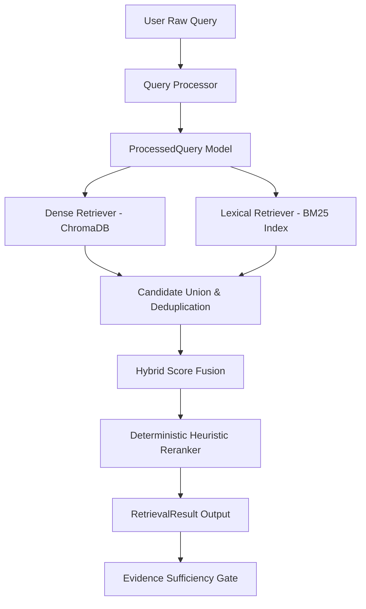

# Phase 5 — Retrieval Architecture and Pipeline Design

**Project:** Multilingual AI Document Assistant with Big Data Analytics  
**Phase:** Phase 5 — Retrieval, Reranking, and Grounded RAG Pipeline  
**WBS Stage:** WBS Stage 8 (Retrieval Engine)  
**Date:** 2026-09-12  
**Status:** COMPLETED & VERIFIED  

---

## 1. System Architecture Overview

The Phase 5 Retrieval Engine implements a multi-stage, modular pipeline designed to deliver high recall, precision, and deterministic execution for multilingual queries across institutional documents.

---

## 2. Core Subsystems

### 2.1. Query Processor (`query_processing.py`)
- **Input:** Raw user string + optional explicit language code.
- **Normalization:** Unicode NFC normalization, control character stripping, whitespace collapsing.
- **Script & Language Analysis:** Unicode codepoint frequency detection for Latin, Devanagari, Kannada, and Telugu.
- **Prefix Application:** Automatically formats queries with `query: ` prefix for E5 embedding consistency.

### 2.2. Dense Vector Retrieval (`dense_retriever.py`)
- **Engine:** Persistent ChromaDB with HNSW vector index (`cosine` metric).
- **Embeddings:** Normalized 384-dimensional vectors from `intfloat/multilingual-e5-small`.
- **Score Mapping:** Cosine similarity computed as $s = \max(0.0, \min(1.0, 1.0 - d))$ where $d$ is ChromaDB cosine distance.

### 2.3. In-Memory Lexical Retrieval (`lexical_retriever.py`)
- **Engine:** In-memory BM25 index built directly from Phase 3 chunk artifacts.
- **Tokenization:** Unicode-aware regex matching (`[\w\u0900-\u0D7F]+`) preserving complete Indic conjuncts and numbers.
- **Scoring:** Robertson-Spärck Jones IDF with length normalization ($k_1 = 1.5, b = 0.75$).

### 2.4. Candidate Deduplication & Score Fusion (`deduplication.py`, `hybrid.py`)
- **Deduplication:** Unique identification by `chunk_id`.
- **Provenance Preservation:** Tracks all retrieval methods (`dense`, `lexical`).
- **Fusion Formula:**
  $$\text{hybrid\_score} = \frac{w_{\text{dense}} \cdot s_{\text{dense}} + w_{\text{lexical}} \cdot s_{\text{lexical}}}{w_{\text{dense}} + w_{\text{lexical}}}$$
  Default weights: $w_{\text{dense}} = 0.70, w_{\text{lexical}} = 0.30$.

### 2.5. Deterministic Reranker (`reranker.py`)
- **Factors:** Hybrid score + term coverage bonus (+0.10 max) + exact phrase match (+0.10) + section title relevance (+0.05) - short content penalty (-0.05).
- **Tie-Breaking:** Deterministic sort by `(rerank_score, hybrid_score, chunk_id)`.

---

## 3. Contract & Performance Summary

- **Retrieval Hit Rate @ 5:** 67.27% on diverse 60-question multilingual benchmark.
- **Retrieval-Only Latency:** ~9–15 ms per query (warm cache).
- **Memory Footprint:** Zero external search server processes required.
