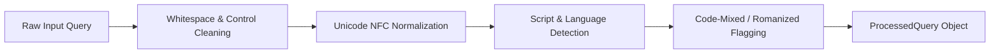

# Phase 5 — Query Processing and Multilingual Language Handling

**Project:** Multilingual AI Document Assistant with Big Data Analytics  
**Phase:** Phase 5 — Retrieval, Reranking, and Grounded RAG Pipeline  
**WBS Stage:** WBS Stage 10 (Multilingual and Code-Mixed Query Handling)  
**Date:** 2026-09-12  

---

## 1. Query Processing Pipeline

Query processing is the foundational stage that prepares user input for semantic vector embedding, lexical indexing, and downstream RAG prompt construction.

---

## 2. Unicode Normalization & Script Detection

### 2.1. NFC Normalization
All input text is converted to Unicode Normalization Form C (`NFC`). This ensures that precomposed characters and combining diacritics in Devanagari (`\u0900-\u097F`), Kannada (`\u0C80-\u0CFF`), and Telugu (`\u0C00-\u0C7F`) map to canonical, identical codepoints before tokenization and embedding.

### 2.2. Script Frequency Analysis
Script classification inspects Unicode block intervals:
- **Devanagari:** `0x0900` to `0x097F` -> Classified as `Devanagari` (Default Hindi).
- **Kannada:** `0x0C80` to `0x0CFF` -> Classified as `Kannada` (Default Kannada).
- **Telugu:** `0x0C00` to `0x0C7F` -> Classified as `Telugu` (Default Telugu).
- **Latin:** Basic & Latin Extended -> Classified as `Latin` (Default English).
- **Mixed:** Queries containing both Latin and Indic scripts -> Classified as `Mixed` (`is_code_mixed = True`).

### 2.3. Romanized and Code-Mixed Handling
- **Romanized Queries:** Text in Latin script with explicitly declared or inferred Indic language context (e.g. `"hajiri niyam kya hai"` with `language="hi"`) is flagged with `is_romanized = True`.
- **Code-Mixed Queries:** Queries like `"MCA attendance rules ಏನು?"` contain both Latin acronyms and Kannada interrogative particles, flagged with `is_code_mixed = True`.

---

## 3. Query Embedding Prefix Contract

For `intfloat/multilingual-e5-small`:
- Document chunks are indexed with prefix `"passage: "`.
- Queries **must always be embedded with prefix `"query: "`**.
- Handled automatically in `SentenceTransformerEmbeddingProvider.embed_query()`.
