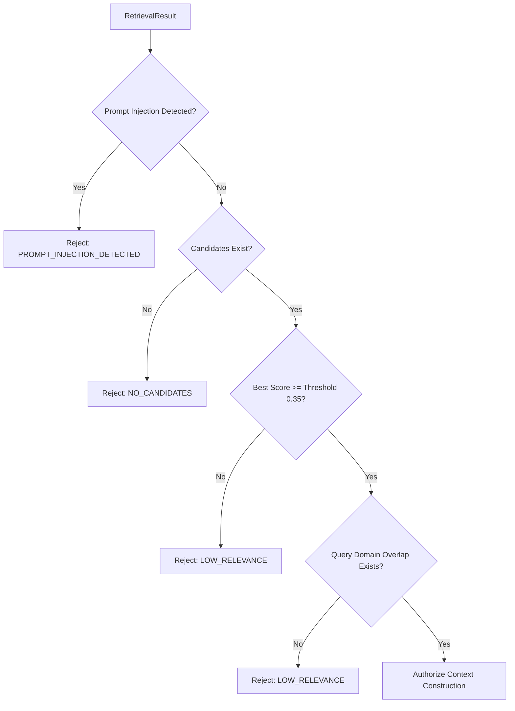

# Phase 5 — Evidence Gating and Context Construction

**Project:** Multilingual AI Document Assistant with Big Data Analytics  
**Phase:** Phase 5 — Retrieval, Reranking, and Grounded RAG Pipeline  
**WBS Stage:** WBS Stage 9 (Grounded RAG and Answer Construction)  
**Date:** 2026-09-12  

---

## 1. Evidence Sufficiency Gate

The **Evidence Gate** (`evidence_gate.py`) is a mandatory pre-generation checkpoint that determines whether the retrieved document evidence is adequate to answer the query.



### 1.1. Gating Criteria
1. **Security Inspection:** Rejects queries containing prompt-injection patterns (`ignore prior instructions`, `admin access granted`).
2. **Relevance Threshold:** Best observed retrieval score must meet `RAG_MIN_EVIDENCE_SCORE` (default `0.35`).
3. **Domain Keyword Alignment:** For Latin script queries, verifies that non-stopword query tokens appear in retrieved candidates. Non-Latin Indic queries are evaluated semantically to support cross-lingual document search.
4. **Metadata Integrity:** Validates that candidate chunk ID, document ID, filename, and page number are valid.

---

## 2. Context Construction & Budgeting

The **Context Builder** (`context_builder.py`) prepares the structured and serialized context bundle.

### 2.1. Budget Constraints
- **Max Chunks:** Default `5` top-ranked chunks.
- **Max Characters:** Default `6,000` characters.

### 2.2. Context Serialized Format
```text
[Source 1]
Document: attendance_policy.pdf
Page: 1
Section: 1.1 Minimum Attendance
Chunk ID: doc_0001_p01_c01
Content:
Students must maintain a minimum of 75% attendance in each registered theory and practical course...
```
Internal filesystem paths are strictly excluded from the context string to preserve privacy and prevent data leakage.
