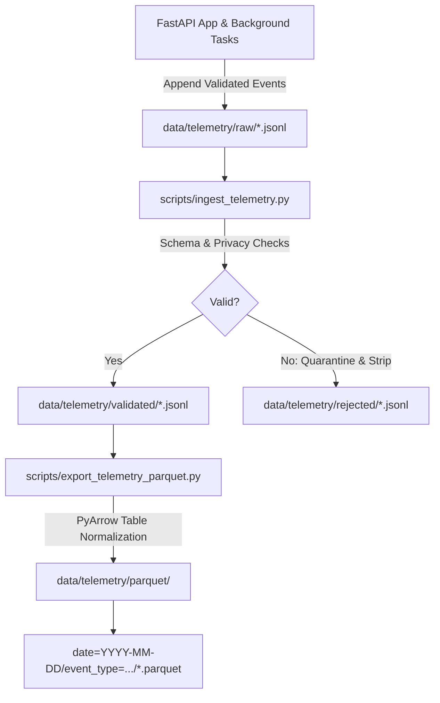

# Phase 7 — JSONL Ingestion and Parquet Data Lake

## 1. Pipeline Architecture

The telemetry batch ingestion and data lake pipeline converts raw event streams into partitioned, columnar Parquet tables for analytical queries.



---

## 2. Ingestion Engine (`scripts/ingest_telemetry.py`)

### Responsibilities
1. **Stream Parsing**: Reads raw `.jsonl` files line-by-line in bounded memory.
2. **Privacy Filtering**: Invokes `TelemetryValidator` to verify that no prohibited field names (`query`, `prompt`, `answer`, `passage`, `token`, etc.) or PII patterns exist.
3. **Quarantine Isolation**: Malformed, poisoned, or unparseable lines are directed to `data/telemetry/rejected/` with structured rejection reasons.
4. **Deduplication**: Preserves `event_id` sets across runs to ensure idempotent ingestion.
5. **Reporting**: Generates execution metrics covering records read, valid vs. rejected counts, and event type distributions.

### CLI Usage
```bash
python scripts/ingest_telemetry.py \
  --input data/telemetry/raw \
  --output data/telemetry/validated \
  --rejected data/telemetry/rejected
```

---

## 3. Partitioned Parquet Lake (`scripts/export_telemetry_parquet.py`)

### Partitioning Strategy
- Primary Partition Key: `date` (`YYYY-MM-DD`)
- Secondary Partition Key: `event_type` (`query_completed`, `retrieval_completed`, `rag_completed`, `error`)

High-cardinality keys such as `request_id_hash` or `event_id` are stored as standard table columns to avoid small-file fragmentation.

### PyArrow Columnar Types
- Floating point latencies (`retrieval_latency_ms`, `total_latency_ms`) -> `pa.float64()`
- Integer counts (`candidate_count`, `retrieved_chunk_count`, `citation_count`) -> `pa.int32()`
- Boolean indicators (`is_code_mixed`, `grounded`, `fallback_used`, `citation_valid`) -> `pa.bool_()`
- Categorical dimensions (`language`, `script`, `provider`, `answer_mode`) -> `pa.string()`
- Missing optional values are assigned schema-consistent default scalars (`0`, `0.0`, `""`, `false`).

### CLI Usage
```bash
python scripts/export_telemetry_parquet.py \
  --validated data/telemetry/validated \
  --output data/telemetry/parquet
```
