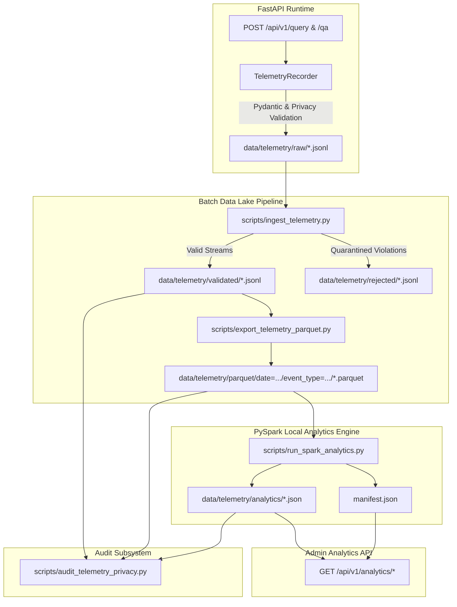

# Phase 7 — Validation and Phase Closure Report

## 1. Executive Summary & Authorization
- **Phase**: Phase 7 — Privacy-Preserving Telemetry, Parquet Data Lake, PySpark Analytics, and Analytics API
- **Status**: Complete & Verified
- **Scope Implemented**: WBS Stages 11, 12, 13, 14, and 15
- **Resource Environment**: Apple Silicon Mac (M-series, 16 GB Unified Memory, macOS Sonoma/Darwin arm64, CPU-only local execution)

---

## 2. Architecture & Components

---

## 3. Telemetry Schema & Zero-Raw-Data Privacy

### Enforced Contract
- All events conform to Schema Version `1.0`.
- Strongly typed Pydantic models: `UnifiedQueryTelemetryEvent`, `RetrievalTelemetryEvent`, `RAGTelemetryEvent`, `ErrorTelemetryEvent`.
- **Zero Raw Data Persistence**: Absolute prohibition of user query strings, prompt templates, document content, chunk text, LLM answers, and PII.
- **Defensive String Validation**: All string values are checked against email/phone/token regexes and bounded at 200 characters.

---

## 4. Ingestion, Parquet Lake, and PySpark Analytics

1. **Ingestion (`scripts/ingest_telemetry.py`)**:
   - Validated streaming parser isolating corrupted or poisoned logs.
   - Idempotent deduplication tracking `event_id` sets.
2. **Parquet Data Lake (`scripts/export_telemetry_parquet.py`)**:
   - Partitioned by `date=YYYY-MM-DD` and `event_type=...`.
   - Columnar Snappy compression via PyArrow.
3. **PySpark Batch Processing (`scripts/run_spark_analytics.py`)**:
   - Local engine (`local[*]`) with 4 shuffle partitions.
   - Computes Volume, Language, Retrieval, RAG, Reliability, and Time-Series metric sets.
   - Emits structured JSON metrics and `manifest.json`.

---

## 5. Analytics API Endpoints

Mounted under `/api/analytics` and `/api/v1/analytics`:
- `GET /health`
- `GET /summary`
- `GET /volume`
- `GET /languages`
- `GET /retrieval`
- `GET /rag`
- `GET /errors`
- `GET /timeseries`

---

## 6. Privacy Audit Verification

The audit engine scanned 17 files and 1,082 records across JSONL, Parquet, and analytics directories with **0 violations detected** (`STATUS: PASS`).
